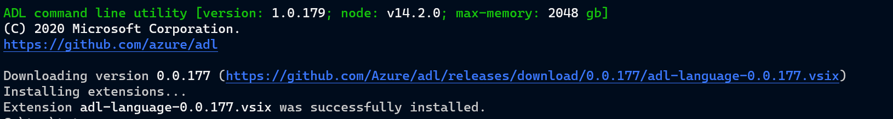

# Using the ADL ClI

## Requirements

The following tools are needed to use the ADL CLI and the VSCode extension

  - NodeJS 12+ (NodeJS 14+ has better perf, but 12 should do)
  - VSCode 

## Installing ADL tools, and the vscode extension
Use the NodeJS `npm` tool to install the cli

> `npm install -g @azure-tools\adl`

``` text
+ @azure-tools/adl@1.0.179
updated 1 package in 8.197s
```

You can get the command-line help for the ADL cli:

> `adl --help`


And you can install the preview ADL-Langauge vscode extension:
> `adl code` (use `adl code --insiders` to install to the code-insiders plugins instead)




## Creating a new ADL project:

You can create a new ADL project by going to an empty folder and running:

> ``` powershell
> mkdir redis # create a new folder
> cd redis # go into the folder
> adl init # create the project
> ```


## Adding an ADL extension to the project

You can add a reference to an ADL package from the command line:

> `adl add --pkg:@azure-tools/adl.rules.azure` 


## Importing from an existing OpenAPI 2/3 file

You can import existing code from an OpenAPI file:

> `adl import https://github.com/Azure/azure-rest-api-specs/tree/master/specification/redis/resource-manager/Microsoft.Cache/stable/2018-03-01/redis.json`

and then open it in vscode:

> `code . `

You should see the imported content.


## Configuring the `api.yaml` file 

The `api.yaml` file for this project looks like this:

``` yaml
# ADL Project file
name: UnnamedService

# information about this service
metadata:
  description: Description for this service.

# ADL Extension packages required for this service
use:
  - "@azure-tools/adl.types.core" # ADL core types 
  - "@azure-tools/adl.rules.azure"

```

### Changing settings for rules

An extension package that has linter rules can be configured by adding an `override` section

``` yaml
override: 
  # specifying metdata changes for a bunch of rules: 

  azure/rules/.*:        # a regex to match the rule id (may match multiple rules)
    meta:
      severity: warning   # change all these to warnings instead of errors

  # you can specify a single rule and override 'data' (parameters) for the rule 
  # and overide changes made by an earlier override.
  azure/rules/description-required: 
    meta: 
      severity: error   # make this one an error again
    data: 
      minLength: 15     # parameters to the rule 

```

When you save the `api.yaml` file, vscode will automatically load changed settings.


## VSCode Extension

The VSCode extension recognizes an ADL project by the presence of the `api.yaml` file.

When active, it will automatically install any ADL extensions/rules/etc that are in the `api.yaml` file.

You can go hover over errors and see what the problem is.

> example edit the `defaultName.ts` file


The presence of the light bulb will tell you there is a fix available for that. clicking on it:


